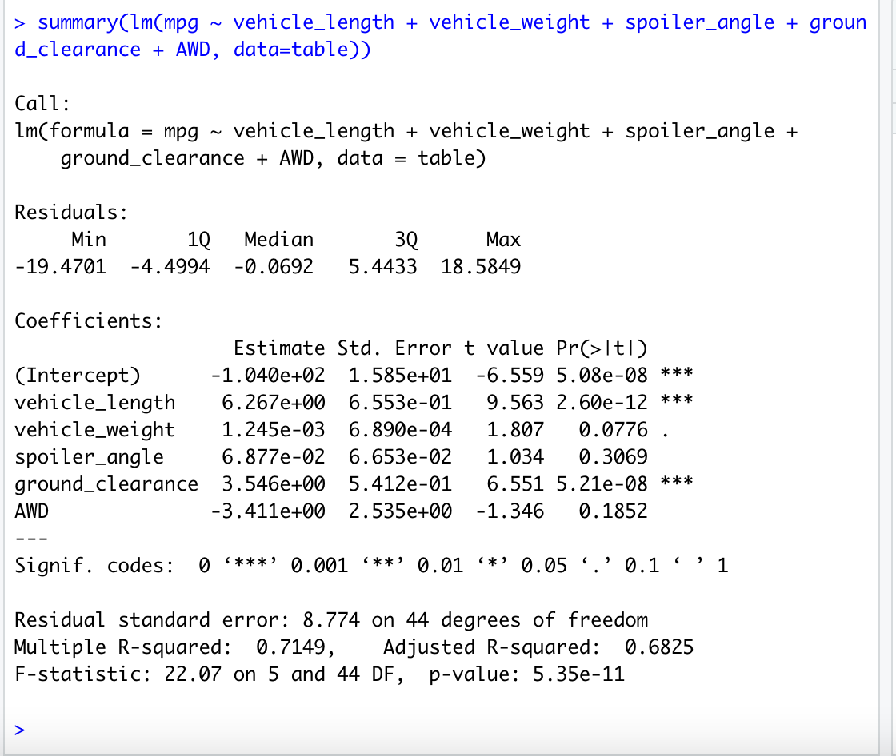
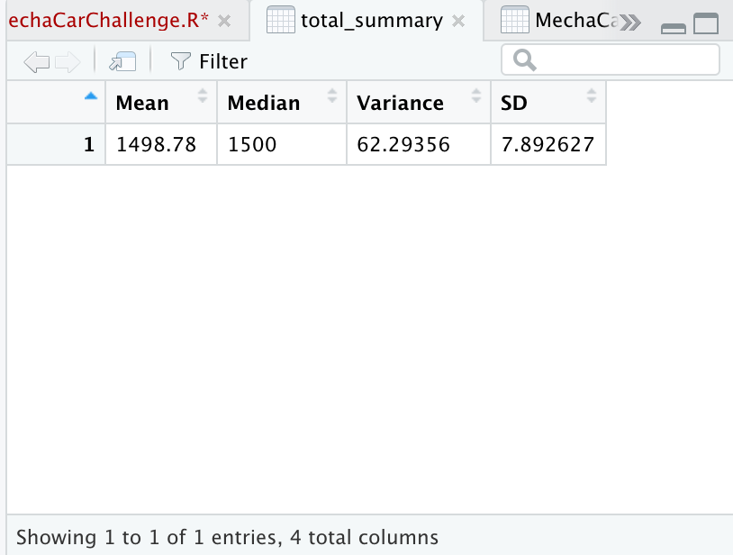
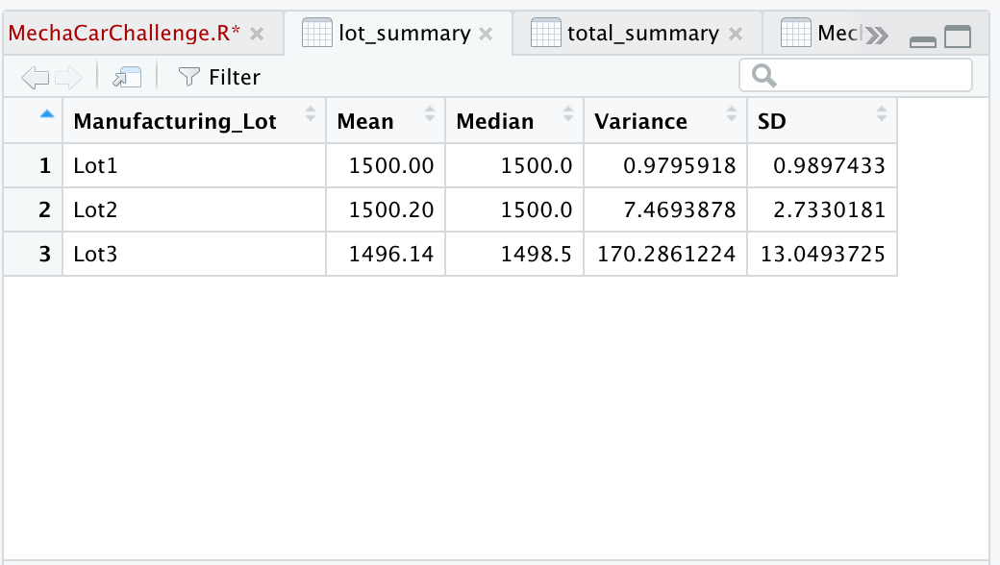
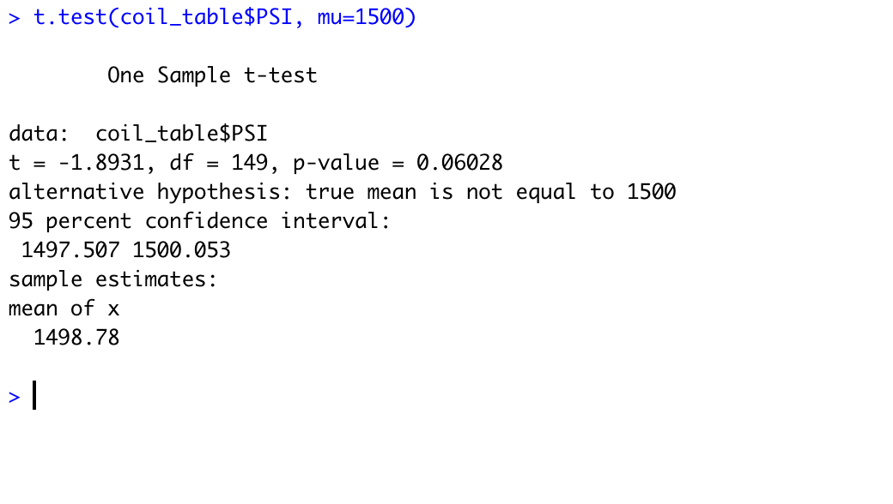
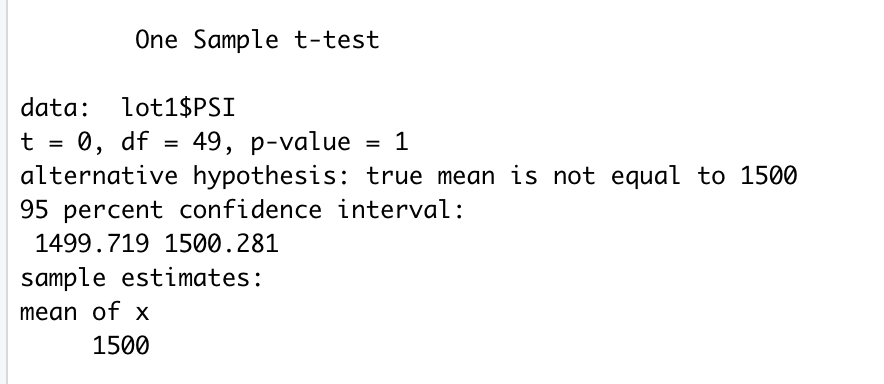
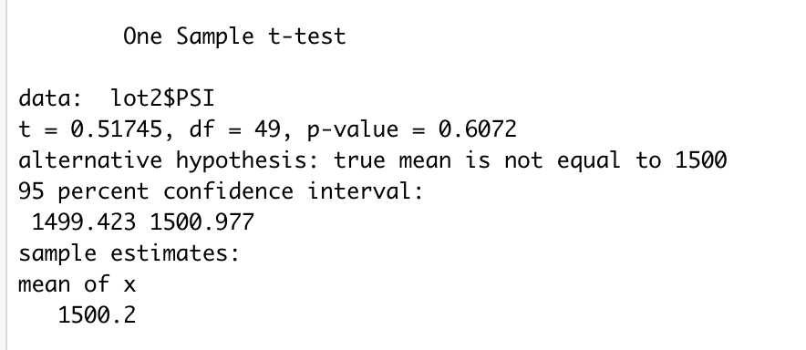
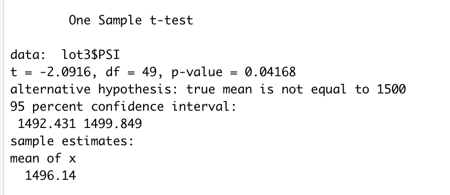

# MechaCar Statistical Analysis
## Linear Regression to Predict MPG
The first deliverable for this project examined the ability of various factors to predict MPG using a multiple linear regression model. The output is shown here:   
  
1. Which variables/coefficients provided a non-random amount of variance to the mpg values in the dataset?  
The variables that provided a non-randome amount of variance to the mpg values were vehicle length and ground clearance. 
2. Is the slope of the linear model considered to be zero? Why or why not?  
No, the R-squared value is approximately 0.7 and the p value is 5e-11, which is below the significance value of 0.05. 
3. Does this linear model predict mpg of MechaCar prototypes effectively? Why or why not?  
Yes, it has an R-squared of 0.7, meaning that around 70% of the variability in MPG can be explained by the model. 

## Summary Statistics on Suspension Coils
The second deliverable examined the summary statistics for the suspension coils for the MechaCar data as a whole and for each of its lots. 
Total Summary:  
  
Lot Summary:  
  
The design specifications for the MechaCar suspension coils dictate that the variance of the suspension coils must not exceed 100 pounds per square inch. Does the current manufacturing data meet this design specification for all manufacturing lots in total and each lot individually? Why or why not?  
The current manufacturing overall has a variance of 62 pounds per square inch. This is line with the requirements of 100 pounds per square inch. However, the current manufacturing data for Lot 3 does not meet this specification, with its variance being 162 pounds per square inch.   

## T-Tests on Suspension Coils
The third deliverable performed t-tests to compare the means from this dataset to the population mean of 1500 pounds per square inch. 
1. The first t-test analyzed the mean of the dataset as a whole. This result showed no significant difference, with a p of 0.06 being slighly above the significance level of 0.05. Full output is shown below.   
  
2. The second, third, and fourth t-tests compared the means from each lot in the dataset to the population mean. Lot 1 was not a significant difference, with a p value of 1. Lot 2 was also not signicant, with a p value of 0.6. However, Lot 3 was significantly different with a p value of 0.04.  
Lot 1:  
  
Lot 2: 
  
Lot 3:  
  

## Study Design: MechaCar Competition
A study design conmparing MechaCar to its competiton could examine the difference in cost between MechaCar and its competition. An ANOVA could be used to compare the average cost of MechCars to the average costs of its competitors. The null hypothesis would be that there is no significant difference between MechaCar and its competitors, and an alternative hypothesis could be that there is a signficant difference. Data would be needed on the prices for all of the cars being sold by each company. 
